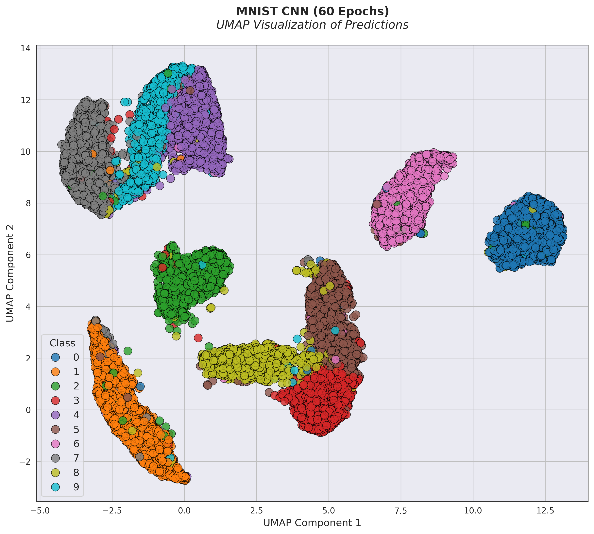

# ClassificationComparison

Code to compare classification algorithms on various datasets. See [LEARN.md](./LEARN.md) for implementation information

## Table of Contents

- [Results & Demos](#results--demos)
- [Installation & Usage](#installation--usage)

## Results & Demos

<div style="text-align: center;">
    
</div>

### Datasets

- [MNIST](https://www.kaggle.com/c/digit-recognizer)
- [Tiny ImageNet](https://huggingface.co/datasets/zh-plus/tiny-imagenet)

## Installation & Usage

1. Clone the repository

```bash
git clone https://github.com/DragonDev07/ClassificationComparison.git
```

2. Install the required packages

```bash
pip install -r requirements.txt
```

3. Run main.py

```bash
cd src
python main.py
```
